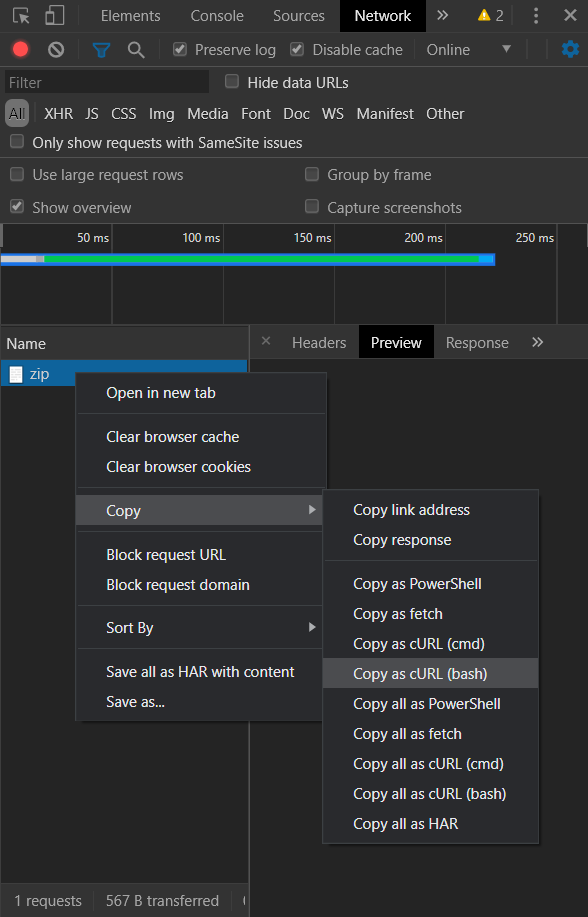
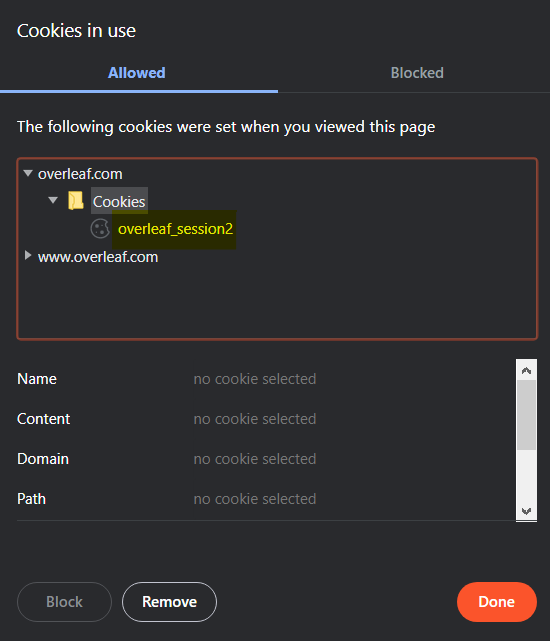

# Overleaf 2 GitHub

A minimalistic Proof-of-Concept bash script that fetches your project's ZIP from Overleaf and pushes it to your GitHub repository.

Quick start? Read [instructions](#instructions), but before please read...

## The *Why* and the *How*

I wanted to learn something about [*replaying requests*](https://developers.google.com/web/updates/2015/05/replay-a-network-request-in-curl) and [*CSRF*](https://owasp.org/www-project-cheat-sheets/cheatsheets/Cross-Site_Request_Forgery_Prevention_Cheat_Sheet) in the real world, so I checked how to apply this to one of my favorite LaTeX IDEs **Overleaf**.

> Please note: I did **not** glance at the public Overleaf repo [right here on GitHub](https://github.com/overleaf)! There would not be much fun in simply analyzing source code; instead, I wanted to learn how to apply the techniques as an outsider, only being able to experiment with the public information the site itself voluntarily supplies. Before, I did not even now that there is a public repo, but most parts of Overleaf are Open Source, which is great! 

### Tricky CSRF-protected login

When loading the login page, a hidden `_csrf` field and a "pre"-session cookie is created. As far as I understand, the cookie **and** the unique `_csrf` token must match the value the server excepts. Otherwise, the login will be `Forbidden`. This ensures that only the user itself is able to make valid requests (and not a phishy site) but normally does not prevent replaying itself when the username and the password is known.

During the login process itself, a `_csrf` field is submitted in the JSON request payload that contains a value of an equally named hidden form field. Even though I started [writing a script](login-experiment/login.sh) which automatically extracts the value and then submits it with the cached cookie, I could not successfully automate a valid login; it always resulted in a `Forbidden` response. This is likely due to (an unobtrusive) reCAPTCHA which I found later.

> See [login-experiment](login-experiment/) for my unsuccessful experiment where I also applied the techniques described in [Play and replay](#play-and-replay)

As an alternative I decided to only replay existing requests without automating the login process.

### Play and replay

For requests on projects, a valid session cookie is required. Luckily, no `_csrf` field is needed for reading access.
We can intercept this cookie and replay it (as long as it's session is active). Utilizing this, we are able to e.g. fetch the project's ZIP without requiring Overleaf to offer a *public* API for it. I do not think that this is reliable in the long term, but wanted to share my result anyway.

This is how I initially replayed the whole "ZIP download" request:

1. Open up Chrome (or similar Chromium-based browser such as Brave)
2. Login and go to the Overleaf project that you want to export
3. Copy URL and append a `/download/zip` to your project URL, e.g. `https://www.overleaf.com/project/1234567890abcdefdeadb33f/download/zip`
4. Open a new tab, press F12 and go to "Network" dev tools tab
5. Enter URL constructed in step #3
6. Under "Network" dev tools tab and then "Copy as cURL (bash)" as shown in the screenshot below



Before, I did not know of Chrome's very useful "Copy as cURL" functionality and I am pretty sure that it is going to be helpful in the future.  

## Instructions

Currently, this project only supports the (more difficult to set-up and maintain) private projects.

### Private Project

#### Get session cookie content

1. Go to your Overleaf project
2. Click on the "Lock" icon positioned left to the URL bar
3. Click on "Cookies" and copy the content of the `overleaf_session2` cookie as shown in the screenshot below



#### Configure this project

1. Clone this repository
2. Create and configure a script in the project's root e.g. called `start-export.sh`:
```sh
export GIT_URL="https://github.com/<YOUR-USERNAME>/<YOUR-REPO>.git"
export OVERLEAF_PROJECT="YOUR-PROJECT-ID"
export SESSION="YOUR-COPIED-COOKIE-CONTENT"

# If you want automatic updates:
./export.sh --auto
```

### Public Project

Maybe coming soon, maybe not.
